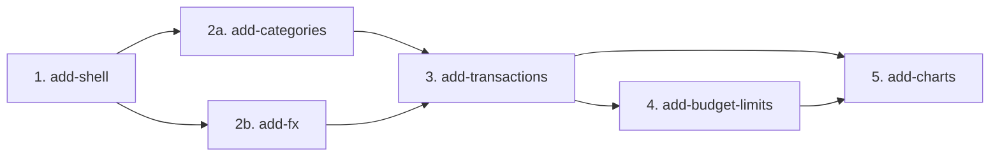

# MVP Capability Change Plan

> Inputs: `docs/product-brief.md`, `docs/requirements.md`, `openspec/specs/`.

## 1. Slicing principles

1. One slice ≈ one cohesive capability; sized to spec → test(red) → implement(green) → review → archive as a unit.
2. Dependency-respecting order — DB schema foundations first; no slice assumes a sibling that ships later.
3. One owner per requirement — every MVP FR assigned to exactly one slice; cross-cutting NFRs honored by every slice.
4. `parallel-safe` = disjoint modules + no shared migration; `serialize` = shared module or migration.

## 2. The capability changes

| # | Change name | Spec | MVP FRs | NFRs travelled | Depends on | Parallel |
|---|---|---|---|---|---|---|
| 1 | `add-shell` | shell | FR-SHELL-01, FR-SHELL-02, FR-SHELL-03 | NFR-A11Y-01, NFR-A11Y-02, NFR-OBS-01, NFR-I18N-01 | — | serialize |
| 2a | `add-categories` | categories | FR-CAT-01, FR-CAT-02, FR-CAT-03, FR-CAT-04 | NFR-OBS-01, NFR-I18N-01 | 1 | parallel-safe (with 2b) |
| 2b | `add-fx` | fx | FR-FX-01, FR-FX-02, FR-FX-03, FR-FX-04, FR-FX-05 | NFR-OBS-01, NFR-I18N-01, NFR-PERF-01 | 1 | parallel-safe (with 2a) |
| 3 | `add-transactions` | transactions | FR-TX-01 – FR-TX-07 | NFR-PERF-01, NFR-OBS-01, NFR-I18N-01 | 2a, 2b | serialize |
| 4 | `add-budget-limits` | budget-limits | FR-BUDGET-01 – FR-BUDGET-05 | NFR-OBS-01, NFR-I18N-01 | 3 | serialize |
| 5 | `add-charts` | charts | FR-CHART-01 – FR-CHART-05 | NFR-PERF-03, NFR-OBS-01, NFR-I18N-01 | 3, 4 | serialize |

**Cross-cutting NFRs every slice MUST honor:** NFR-OBS-01 (console clean), NFR-I18N-01 (all strings in `lib/i18n/en.ts`), NFR-DX-01 (build < 60s).

## 3. Dependency graph



**Critical path:** add-shell → add-categories → add-transactions → add-budget-limits → add-charts (5 serial steps).

**Parallelizable:** add-categories and add-fx may run concurrently in isolated worktrees after add-shell ships — they work on disjoint modules (`lib/categories/` + `db/schema/categories.ts` vs `lib/fx/` with no DB schema) and have no shared migration.

## 4. Per-change scope and exit criteria

### 4.1 `add-shell`

- **Scope in:** App layout (`app/layout.tsx`), top bar component (logo + display-currency selector), responsive CSS grid (`mobile=1col / tablet=2col / desktop=3col` at 768/1280 px breakpoints), empty-state page (`FR-SHELL-03`), `lib/i18n/en.ts` initial string map, `lib/db/repository.ts` typed interface, `lib/db/adapters/sqlite.ts` adapter, `lib/db/migrate.ts` migration runner, `DATABASE_PATH` env wiring, health check on startup.
- **Scope out:** Transaction data, category data, budget logic, charts, FX logic, theme toggle (deferred per ADR-0004).
- **Baseline spec impact:** `openspec/specs/shell/spec.md` — all 3 FRs.
- **Definition of done:**
  - Top bar renders with static currency selector (USD placeholder); selector list to be wired in `add-fx`.
  - Responsive breakpoints verified at 767 px (mobile), 768 px (tablet), 1280 px (desktop).
  - Empty state shows centered prompt + CTA button (no transactions in DB).
  - SQLite adapter connects and runs migrations on startup; `DATABASE_PATH` env respected.
  - `lib/i18n/en.ts` created; all shell string literals sourced from it.
  - `npm run lint && npm run test:run && npm run build` green; traceability 0 failures.
- **Risks:** DB adapter pattern must be established correctly here — it is the foundation every subsequent slice builds on. Get the repository interface right before data slices start.

### 4.2 `add-categories`

- **Scope in:** `db/schema/categories.ts` (id, name, icon, color), migration, `lib/categories/` (validation.ts, queries.ts, service.ts), Route Handlers (`/api/categories`), categories settings UI panel, default seed (7 categories on first run, idempotent), icon picker (fixed ~30 lucide icons), hex color input validation.
- **Scope out:** Per-category budget limits (slice 4), transaction counts per category (slice 3).
- **Baseline spec impact:** `openspec/specs/categories/spec.md` — all 4 FRs.
- **Definition of done:**
  - CRUD UI for categories accessible from a settings panel.
  - Default seed runs on first startup and is idempotent.
  - Delete blocked with inline error if category has transactions (enforced at service layer, not just UI).
  - Hex color validated (6-char #rrggbb); icon validated against the fixed set.
  - All validation error messages sourced from `lib/i18n/en.ts`.
  - Battery green; `@trace FR-CAT-*` annotations on all unit tests.

### 4.3 `add-fx`

- **Scope in:** `lib/fx/convert.ts` (`convertAmount` pure function), `/api/fx/rates` Route Handler (fetches from frankfurter.app), session-scoped in-memory cache, display-currency selector wired in top bar (was static in slice 1), `BC-BRAND-02` footer attribution.
- **Scope out:** Persisting rates per transaction (slice 3 stores the rate alongside the transaction record).
- **Baseline spec impact:** `openspec/specs/fx/spec.md` — all 5 FRs.
- **Definition of done:**
  - `convertAmount(amount, fromCurrency, toCurrency, rates)` passes all unit tests (same-currency, zero-rate error, missing-rate error, locale decimals).
  - Display-currency selector changes active currency; all downstream totals re-derive without DB query.
  - frankfurter.app failure surfaces inline in the transaction form (slice 3 will use this error path).
  - Footer shows "Exchange rates by [frankfurter.app](<url>)".
  - Rate fetch never originates from the client bundle (verified by inspecting the route handler).
  - Battery green; `@trace FR-FX-*` annotations.

### 4.4 `add-transactions`

- **Scope in:** `db/schema/transactions.ts` (id, amount, currency, rate_usd, date, category_id, type, note, created_at), migration, `lib/transactions/` (validation.ts, queries.ts, service.ts), Route Handlers (`/api/transactions`), transaction form modal (add + edit), delete with confirmation, transaction list (filters: month/category/type, pagination/virtualisation, display: date/amount/currency/category icon+name/type badge/note excerpt), rate fetch wired on add.
- **Scope out:** Budget-limit progress bars (slice 4), charts (slice 5).
- **Baseline spec impact:** `openspec/specs/transactions/spec.md` — all 7 FRs.
- **Definition of done:**
  - Full CRUD via modal; list updates without full-page reload (client-side state or SWR).
  - Filters (month/category/type) functional; default = current calendar month.
  - List paginated or virtualised; shows all 6 display fields per FR-TX-07.
  - Rate fetched from `/api/fx/rates` on add; stored in record.
  - All validation errors (blank, negative, unknown currency) surface inline.
  - Battery green; smoke test: create → edit → delete → filter round-trip with real SQLite.

### 4.5 `add-budget-limits`

- **Scope in:** Budget limit column on categories (`ALTER TABLE` migration), `lib/budget/status.ts` (`budgetStatus` pure function), Route Handlers (`/api/categories/:id/limit`), budget-limit input on categories settings, dashboard progress bars (spend vs limit per category, colored green/yellow/red), spend-only display for limitless categories.
- **Scope out:** Per-month limit history, over-budget notifications.
- **Baseline spec impact:** `openspec/specs/budget-limits/spec.md` — all 5 FRs.
- **Definition of done:**
  - `budgetStatus(transactions, limit, displayCurrency, rates)` unit tests pass at boundary values (79%, 80%, 99%, 100%, 101%).
  - Dashboard shows progress bar for each category with a limit; spend-only row for those without.
  - Color correct: green < 80%, yellow 80–99%, red ≥ 100%.
  - Setting/clearing a limit persisted; negative limit rejected inline.
  - Battery green; smoke test: set limit → add transactions → verify bar color and ratio.

### 4.6 `add-charts`

- **Scope in:** `components/charts/SpendingDonutChart.tsx` (client, Recharts `PieChart`), `components/charts/MonthlyBarChart.tsx` (client, Recharts `BarChart`), SSR skeletons matching chart footprint, tooltip with name+amount+%, dashboard chart section, month selector for donut, `/api/charts/data` Route Handler for aggregated data.
- **Scope out:** Data export, historical reports beyond 12 months, custom date ranges.
- **Baseline spec impact:** `openspec/specs/charts/spec.md` — all 5 FRs.
- **Definition of done:**
  - Donut chart renders spending by category for selected month in display currency with legend.
  - Bar chart renders trailing 12 months income + expense per month.
  - Both charts convert amounts via `convertAmount` before rendering.
  - Changing display currency re-renders charts without DB refetch.
  - SSR delivers skeleton; no layout shift on hydration; no SVG in SSR HTML.
  - Hover tooltips show name + amount in display currency + percentage.
  - Empty state (no expenses) renders message instead of blank area.
  - `npm run lint && npm run test:run && npm run build` green; check-a11y green (light + dark); vision-verify passes.

## 5. FR coverage check

| FR | Slice | FR | Slice | FR | Slice |
|---|---|---|---|---|---|
| FR-SHELL-01 | 1 | FR-TX-01 | 3 | FR-CAT-01 | 2a |
| FR-SHELL-02 | 1 | FR-TX-02 | 3 | FR-CAT-02 | 2a |
| FR-SHELL-03 | 1 | FR-TX-03 | 3 | FR-CAT-03 | 2a |
| FR-FX-01 | 2b | FR-TX-04 | 3 | FR-CAT-04 | 2a |
| FR-FX-02 | 2b | FR-TX-05 | 3 | FR-BUDGET-01 | 4 |
| FR-FX-03 | 2b | FR-TX-06 | 3 | FR-BUDGET-02 | 4 |
| FR-FX-04 | 2b | FR-TX-07 | 3 | FR-BUDGET-03 | 4 |
| FR-FX-05 | 2b | FR-CHART-01 | 5 | FR-BUDGET-04 | 4 |
| | | FR-CHART-02 | 5 | FR-BUDGET-05 | 4 |
| | | FR-CHART-03 | 5 | | |
| | | FR-CHART-04 | 5 | | |
| | | FR-CHART-05 | 5 | | |

**Total: 29 MVP FRs across 6 slices (numbered 1, 2a, 2b, 3, 4, 5). No gaps, no duplicates.**

## 6. Sequencing

```
1. add-shell          (serialize)
2a. add-categories    ─┐ parallel-safe after 1
2b. add-fx            ─┘ (isolated worktrees; disjoint modules, no shared migration)
3. add-transactions   (serialize; after 2a AND 2b both merged)
4. add-budget-limits  (serialize; after 3)
5. add-charts         (serialize; after 3 and 4)
```

After each slice archives, run `node scripts/check-traceability.mjs` and `npm run lint && npm run test:run && npm run build` before starting the next.
